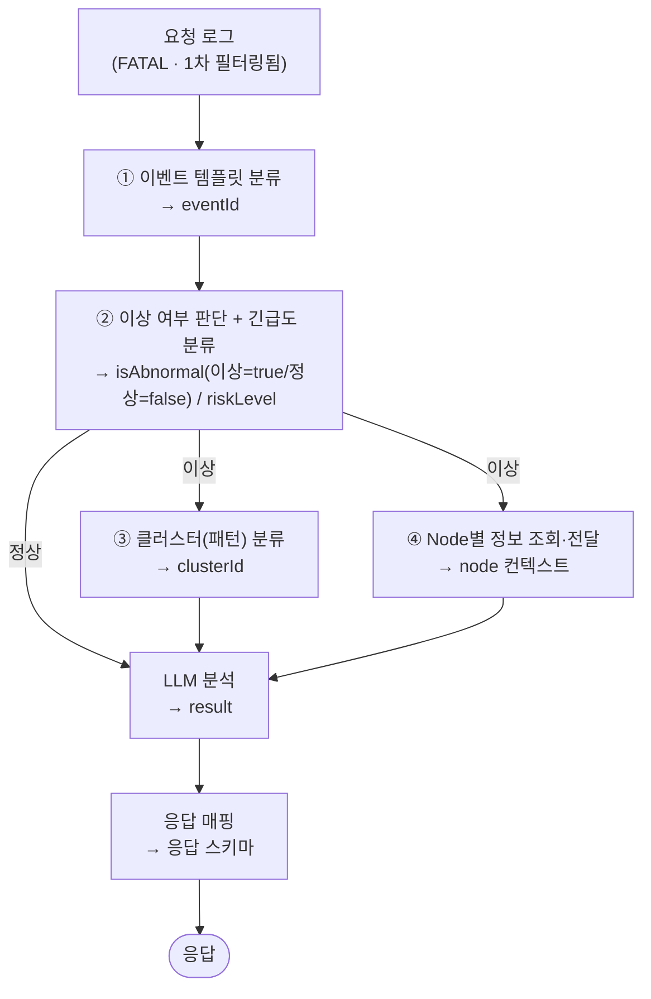

# 로그 분석 API — 명세 및 설계

> Spring 백엔드가 **1차 필터링(FATAL 레벨)** 한 로그를 받아, AI가 분석하여
> 위험도·요약·분석·대응 방안·클러스터·이벤트ID를 돌려주는 API.
> 시스템 전체 구성은 [ArchitectureGuide.md](ArchitectureGuide.md), 단계별 개발 계획은 [implementation_plan.md](implementation_plan.md) 참조.

---

## 1. 개요

- 단건(`POST /ai/v1/analyze`)은 수동·개별 재처리용, 다건(`POST /ai/v1/analyze/batch`)은 스케줄러 기본 경로다.
- 들어오는 로그는 **확정된 이상 로그가 아니다.** Spring에서 레벨 기반(FATAL) 1차 필터만 통과한 상태이므로,
  **이상 여부 판단까지 AI 내부에서 수행**한 뒤 분석 결과를 생성한다.
- 분석에 필요한 컨텍스트는 **4개의 Tool**이 산출하며, 이들은 ChromaDB 대신 **내부 정의 문서를 직접 참조**한다.

### 엔드포인트 요약

| Method | URI | 설명 |
|--------|-----|------|
| POST | `/ai/v1/analyze` | 로그 1건 분석 (수동 / 개별 재처리용) |
| POST | `/ai/v1/analyze/batch` | 로그 다건 분석 (스케줄러 기본 경로) |

### 공통 사항

- **Base URL**: `/ai/v1`
- **Content-Type**: `application/json`
- **시각 표기**: 모든 시각 문자열은 `yyyy-MM-dd HH:mm:ss` 형식 (요청 `occurredAt`, 응답 `analyzedAt`)
- **인증**: 미정(보류) — 추후 결정

---

## 2. 핵심 설계 결정

| 결정 | 내용 | 비고 |
|------|------|------|
| **이상 여부 내부 판단** | 1차 필터(FATAL)만 거친 로그를 받으므로, 정상/이상 판정을 AI 파이프라인 안에서 직접 수행 | 결과는 응답 `isAbnormal` 불리언 (**이상=`true`/정상=`false`**, Spring DB 정의). 정상이면 `result`에 `summary`·`analysis`(정상 사유)만 채움 |
| **ChromaDB 미사용** | 벡터 DB 검색(RAG) 대신, **내부 정의 문서를 그대로 참조**하여 Tool이 분류·정보를 전달 | 운영 의존성 축소 |
| **Tool 4개 + 실행 순서** | ①(템플릿)→②(이상 여부·긴급도) 후, **②가 이상이면** ③(클러스터)·④(Node 정보)를 수행 (아래 4·5장) | ②가 정상으로 판정하면 ③④ 생략하고 LLM 직행 |
| **요청 필드 정리** | 요청에서 `label`·`eventId` 제거 (1차 필터 후 식별자/메타/내용만 전달) | 6장 스키마 반영 |
| **응답 `result`에 `eventId` 포함** | 이벤트 템플릿 분류 결과를 `result` 안에 회신. **이상 로그만 분류**되므로 정상이면 `null` | 5장 스키마 반영 |
| **`domain` 고정 처리** | `domain`은 **BGL 고정값** — **요청에만** 포함하고 응답에는 싣지 않음 | 5장 스키마 반영 |

---

## 3. 처리 흐름



1. 요청 로그를 **① 이벤트 템플릿 분류** Tool에 전달해 `eventId`를 확보한다. (선행 필수)
2. **② 이상 여부 판단 + 긴급도 분류**가 ① 결과를 기반으로 `isAbnormal`(이상 여부: 이상=`true`/정상=`false`)·`riskLevel`을 산출한다. **여기서 분기한다.**
3. ②가 **정상(`false`)** 으로 판정하면 ③④를 건너뛰고 **바로 LLM 분석**으로 이어져 정상 사유(`summary`·`analysis`)만 작성한다.
4. ②가 **이상(`true`)** 이면 **③(클러스터)·④(Node 정보 조회)** 를 수행한 뒤 LLM 분석에 합류하여 `result`의 모든 필드(위험도·요약·분석·대응·클러스터)를 채운다. (정상 경로는 `action`=`""`, `riskLevel`·`clusterId`=`null`)
5. 결과를 응답 스키마로 매핑하여 `isAbnormal`(이상 여부)·`result`(`eventId` 포함, 정상·이상 모두)를 반환한다.

---

## 4. Tool 구성 (4개)

각 Tool은 ChromaDB 대신 **내부 정의 문서를 직접 참조**하여 결과를 전달한다.
구현 상세(시그니처·반환 스키마·테스트)는 별도 문서에서 다룬다.

| # | Tool | 역할 | 선행 의존 | 산출 → 응답 필드 |
|---|------|------|-----------|------------------|
| ① | **이벤트 템플릿 분류** | 로그를 사전 정의된 이벤트 템플릿에 매칭 (규칙 기반) | — (선행) | `result.eventId` (이상 로그) |
| ② | **이상 여부 판단 + 긴급도 분류** | 템플릿 기반으로 정상/이상 판정 및 위험도 산정. **분기 기준** | ① 필요 | `isAbnormal`(이상=true/정상=false), `riskLevel` |
| ③ | **클러스터(패턴) 분류** | 템플릿 기반으로 유사 로그 패턴(클러스터) 식별 | ② (이상) | `clusterId` |
| ④ | **Node별 정보 조회·전달** | `node` 기준 부가 정보 조회 후 분석 컨텍스트로 제공 | ② (이상) | LLM 분석 컨텍스트 |

> **실행 순서:** ① → ② 수행 후 ②의 판정으로 **분기**한다. **이상**이면 ③ · ④ 를 수행하고, **정상**이면 ③④를 건너뛴다.
> **정상 분기:** ②가 **정상**으로 판정하면 ③④ 없이 바로 LLM 분석으로 이어진다(정상 사유만 작성).

---

## 5. API 명세

### 5.1 POST `/ai/v1/analyze` — 로그 1건 분석

수동 또는 개별 재처리 용도로 로그 한 건을 분석한다.

#### Request

```json
{
  "logId": 0,
  "node": "string",
  "nodeRepeat": "string",
  "component": "string",
  "logType": "string",
  "occurredAt": "string",
  "logLevel": "string",
  "content": "string",
  "domain": "string"
}
```

| 필드 | 타입 | 설명 |
|------|------|------|
| logId | int | 로그 식별자 |
| node | str | 노드 |
| nodeRepeat | str | 노드 반복 정보 |
| component | str | 컴포넌트 |
| logType | str | 로그 타입 |
| occurredAt | str | 로그 발생 시각 (`yyyy-MM-dd HH:mm:ss` 형식 문자열) |
| logLevel | str | 로그 레벨 |
| content | str | 로그 내용 |
| domain | str | 도메인 — **BGL 고정값** (요청 입력, 응답 미포함) |

#### Response

`result`는 정상·이상 모두 포함된다. **정상(`isAbnormal: false`)이면** `summary`·`analysis`에 정상 사유만 담기고, `action`은 `""`, `eventId`·`riskLevel`·`clusterId`는 `null`이다. 아래 예시는 이상(`isAbnormal: true`)인 경우다.

```json
{
  "logId": 0,
  "isAbnormal": true,
  "result": {
    "eventId": "string",
    "riskLevel": "string",
    "summary": "string",
    "analysis": "string",
    "action": "string",
    "clusterId": 0,
    "analyzedAt": "yyyy-MM-dd HH:mm:ss"
  },
  "processingTimeMs": 0
}
```

| 필드 | 타입 | 설명 | 산출 |
|------|------|------|------|
| logId | int | 분석 대상 로그 식별자 | (요청 echo) |
| isAbnormal | bool | 이상 여부 (`true`=이상 / `false`=정상) | Tool ② |
| result | object | 분석 결과 (정상·이상 모두 포함) | 결과 매핑 |
| result.eventId | str \| null | 이벤트 식별자 (`정상`이면 `null`) | Tool ① |
| result.riskLevel | str \| null | 위험도 (`긴급`/`높음`/`보통`/`낮음`). `정상`이면 `null` | Tool ② |
| result.summary | str | 요약 — `정상`이면 정상 사유 | LLM |
| result.analysis | str | 분석 내용 — `정상`이면 정상 사유 | LLM |
| result.action | str | 대응 방안 (`정상`이면 `""`) | LLM |
| result.clusterId | int \| null | 클러스터 식별자 (`정상`이면 `null`) | Tool ③ |
| result.analyzedAt | str | 분석/판정 시각 (`yyyy-MM-dd HH:mm:ss` 문자열) | 응답 매핑 |
| processingTimeMs | int | 처리 소요 시간 (ms) | 응답 매핑 |

---

### 5.2 POST `/ai/v1/analyze/batch` — 로그 다건 분석

스케줄러 기본 경로로, 여러 로그를 한 번에 분석한다. 개별 로그 실패가 전체 배치를 막지 않는다.

각 항목은 두 개념을 구분한다 — **`processStatus`**(처리 완료 여부, `success`/`fail`)와 **`isAbnormal`**(이상 여부, `true`=이상/`false`=정상).
처리 실패면 `errorMessage`만 채운다. 성공이면 `isAbnormal`과 `result`(`eventId` 포함)를 모두 채우되, 정상(`false`)이면 `result`의 `summary`·`analysis`(정상 사유)만 채워지고 나머지는 빈값이다.

#### Request

```json
{
  "logs": [
    {
      "logId": 0,
      "node": "string",
      "nodeRepeat": "string",
      "component": "string",
      "logType": "string",
      "occurredAt": "string",
      "logLevel": "string",
      "content": "string",
      "domain": "string"
    }
  ]
}
```

| 필드 | 타입 | 설명 |
|------|------|------|
| logs | array | 분석할 로그 객체 배열 (각 객체 필드는 단건 분석 Request와 동일, `domain` 포함) |

#### Response

```json
{
  "totalCount": 0,
  "processingTimeMs": 0,
  "results": [
    {
      "logId": 0,
      "processStatus": "success",
      "isAbnormal": true,
      "result": {
        "eventId": "string",
        "riskLevel": "string",
        "summary": "string",
        "analysis": "string",
        "action": "string",
        "clusterId": 0,
        "analyzedAt": "yyyy-MM-dd HH:mm:ss"
      }
    },
    {
      "logId": 0,
      "processStatus": "fail",
      "errorMessage": "string"
    }
  ]
}
```

| 필드 | 타입 | 설명 |
|------|------|------|
| totalCount | int | 처리한 로그 총 개수 |
| processingTimeMs | int | 전체 처리 소요 시간 (ms) |
| results | array | 로그별 분석 결과 배열 |
| results[].logId | int | 로그 식별자 |
| results[].processStatus | str | 처리 완료 여부 (`success` / `fail`) |
| results[].isAbnormal | bool \| null | 이상 여부 (`true`=이상 / `false`=정상). 처리 실패 시 null |
| results[].result | object \| null | 성공 시 분석 결과(eventId, riskLevel, summary, analysis, action, clusterId, analyzedAt). `정상`이면 일부 필드만 채워짐(summary·analysis; eventId·riskLevel·clusterId는 null). 처리 실패 시 null |
| results[].result.eventId | str \| null | 이벤트 식별자 (`정상`이면 null) |
| results[].errorMessage | str | 처리 실패 시 오류 메시지 |

---

## 6. 공통 에러 응답

요청 자체가 실패한 경우(검증 실패, 내부 오류 등) 아래 공통 스키마로 응답한다.
**배치의 개별 로그 실패**는 전체 요청 실패가 아니므로, 이 스키마가 아니라 `results[].processStatus="fail"` + `results[].errorMessage`로 표현한다(5.2 참조).

```json
{
  "code": "string",
  "message": "string",
  "detail": "string"
}
```

| 필드 | 타입 | 설명 |
|------|------|------|
| code | str | 에러 코드 (아래 표) |
| message | str | 사람이 읽을 수 있는 에러 설명 |
| detail | str | 추가 상세 (선택, 디버깅용) |

| HTTP 상태 | code | 발생 상황 |
|-----------|------|-----------|
| 422 | `VALIDATION_ERROR` | 요청 스키마 검증 실패 (필수 필드 누락·타입 오류 등) |
| 503 | `LLM_TIMEOUT` | LLM 응답 지연/타임아웃 |
| 502 | `LLM_ERROR` | LLM 호출 실패·구조화 출력 파싱 실패 |
| 500 | `INTERNAL_ERROR` | 그 외 내부 처리 오류 |

### 6-1. 단건 — 에러

부분 응답이 없다. 분석 실패 시 위 공통 스키마(HTTP 4xx/5xx)로 응답한다. 예) `500`:

```json
{ "code": "INTERNAL_ERROR", "message": "분석 처리 중 오류가 발생했습니다.", "detail": "..." }
```

### 6-2. 다건 — 일부 에러 (부분 실패)

개별 로그 실패는 전체 배치를 막지 않는다. **HTTP 200**으로 응답하며 실패 항목만 `processStatus="fail"` + `errorMessage`로 표시된다(성공·실패 혼재, 5.2 참조).

### 6-3. 다건 — 전체 에러

요청 자체가 깨진 경우(스키마 검증 실패 등) 개별 항목이 아니라 **요청 전체**가 공통 스키마(HTTP 4xx/5xx)로 떨어진다. `results`는 반환되지 않는다. 예) `422`:

```json
{ "code": "VALIDATION_ERROR", "message": "요청 형식이 올바르지 않습니다.", "detail": "logs: field required" }
```

> 예외 계층·매핑 규칙 등 **에러 처리 설계**와 **베이스모델(DTO) 설계**는 [ModelDesign.md](ModelDesign.md) 참조.
