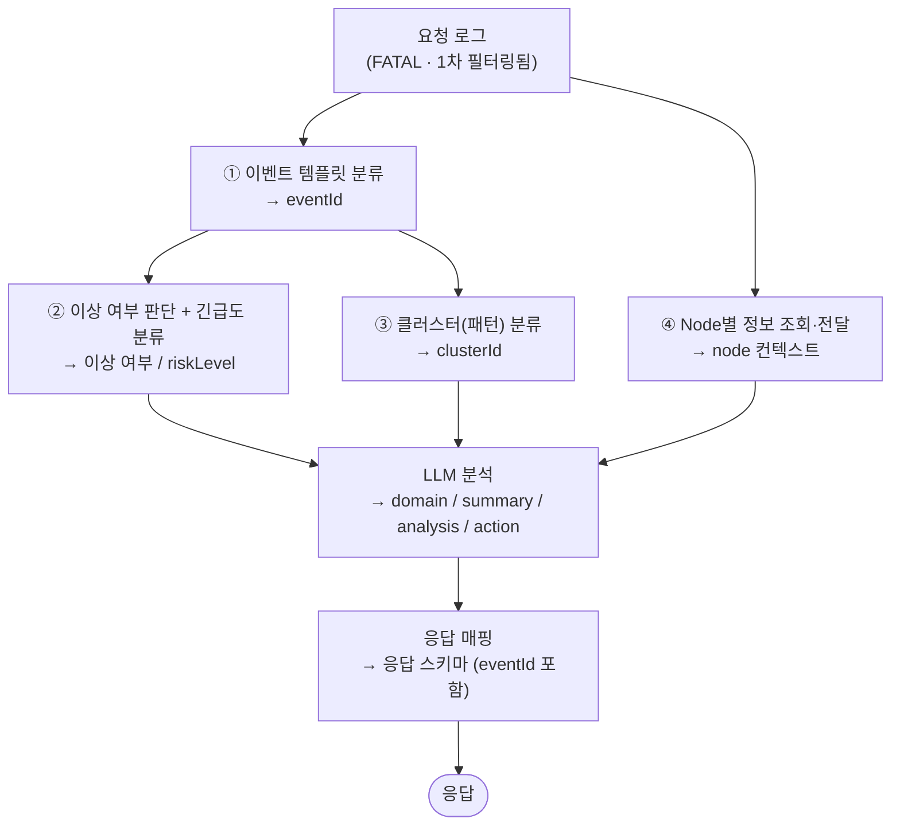

# 로그 분석 API — 명세 및 설계

> Spring 백엔드가 **1차 필터링(FATAL 레벨)** 한 로그를 받아, AI가 분석하여
> 도메인·위험도·요약·분석·대응 방안·클러스터·이벤트ID를 돌려주는 API.
> 시스템 전체 구성은 [ArchetectureGuide.md](ArchetectureGuide.md), 단계별 개발 계획은 [implementation_plan.md](implementation_plan.md) 참조.

---

## 1. 개요

- 단건(`POST /ai/v1/analyze`)은 수동·개별 재처리용, 다건(`POST /ai/v1/analyze/batch`)은 스케줄러 기본 경로다.
- 들어오는 로그는 **확정된 이상 로그가 아니다.** Spring에서 레벨 기반(FATAL) 1차 필터만 통과한 상태이므로,
  **이상 여부 판단까지 AI 내부에서 수행**한 뒤 분석 결과를 생성한다.
- 분석에 필요한 컨텍스트는 **4개의 Tool**이 산출하며, 이들은 ChromaDB 대신 **내부 정의 문서를 직접 참조**한다.

### 엔드포인트 요약

| Method | URI | 설명 |
|--------|-----|------|
| POST | `/ai/v1/analyze` | 로그 1건 분석 (수동 / 개별 재처리용) |
| POST | `/ai/v1/analyze/batch` | 로그 다건 분석 (스케줄러 기본 경로) |

---

## 2. 핵심 설계 결정

| 결정 | 내용 | 비고 |
|------|------|------|
| **이상 여부 내부 판단** | 1차 필터(FATAL)만 거친 로그를 받으므로, 정상/이상 판정을 AI 파이프라인 안에서 직접 수행 | 외부 `label`에 의존하지 않음 |
| **ChromaDB 미사용** | 벡터 DB 검색(RAG) 대신, **내부 정의 문서를 그대로 참조**하여 Tool이 분류·정보를 전달 | 운영 의존성 축소 |
| **Tool 4개 + 실행 순서** | 이벤트 템플릿 분류가 **선행**되어야 이상 여부·긴급도·클러스터 분류가 가능 (아래 4·5장) | Node 정보 조회는 독립 실행 |
| **요청 필드 정리** | 요청에서 `label`·`eventId` 제거 (1차 필터 후 식별자/메타/내용만 전달) | 6장 스키마 반영 |
| **응답에 `eventId` 포함** | 이벤트 템플릿 분류 결과를 응답으로 회신 | 6장 스키마 반영 |

---

## 3. 처리 흐름



1. 요청 로그를 **① 이벤트 템플릿 분류** Tool에 전달해 `eventId`를 확보한다. (선행 필수)
2. 템플릿이 분류되면 **② 이상 여부 판단 + 긴급도 분류**, **③ 클러스터 분류**가 그 결과를 기반으로 수행된다.
3. **④ Node별 정보 조회**는 ①에 의존하지 않고 독립적으로 컨텍스트를 확보한다.
4. ②가 **이상**으로 판정하면 긴급도(`riskLevel`)와 함께, 4개 Tool 산출물·원본 로그를 LLM 분석에 합류시켜 도메인·요약·분석·대응 방안을 작성한다.
5. 결과를 응답 스키마로 매핑하여 `eventId`를 포함해 반환한다.

---

## 4. Tool 구성 (4개)

각 Tool은 ChromaDB 대신 **내부 정의 문서를 직접 참조**하여 결과를 전달한다.
구현 상세(시그니처·반환 스키마·테스트)는 별도 문서에서 다룬다.

| # | Tool | 역할 | 선행 의존 | 산출 → 응답 필드 |
|---|------|------|-----------|------------------|
| ① | **이벤트 템플릿 분류** | 로그를 사전 정의된 이벤트 템플릿에 매칭 (규칙 기반) | — (선행) | `eventId` |
| ② | **이상 여부 판단 + 긴급도 분류** | 템플릿 기반으로 정상/이상 판정 및 위험도 산정 | ① 필요 | 이상 여부, `riskLevel` |
| ③ | **클러스터(패턴) 분류** | 템플릿 기반으로 유사 로그 패턴(클러스터) 식별 | ① 필요 | `clusterId` |
| ④ | **Node별 정보 조회·전달** | `node` 기준 부가 정보 조회 후 분석 컨텍스트로 제공 | 독립 | LLM 분석 컨텍스트 |

> **실행 순서:** ① → (② · ③) 는 템플릿 분류 결과에 의존하므로 ① 이후 수행한다. ④ 는 ①과 무관하게 병렬 실행 가능하다.

---

## 5. API 명세

### 5.1 POST `/ai/v1/analyze` — 로그 1건 분석

수동 또는 개별 재처리 용도로 로그 한 건을 분석한다.

#### Request

```json
{
  "logId": 0,
  "node": "string",
  "nodeRepeat": "string",
  "component": "string",
  "logType": "string",
  "logTs": "string",
  "logLevel": "string",
  "content": "string"
}
```

| 필드 | 타입 | 설명 |
|------|------|------|
| logId | int | 로그 식별자 |
| node | str | 노드 |
| nodeRepeat | str | 노드 반복 정보 |
| component | str | 컴포넌트 |
| logType | str | 로그 타입 |
| logTs | str | 로그 타임스탬프 |
| logLevel | str | 로그 레벨 |
| content | str | 로그 내용 |

#### Response

```json
{
  "logId": 0,
  "eventId": "string",
  "result": {
    "domain": "string",
    "riskLevel": "string",
    "summary": "string",
    "analysis": "string",
    "action": "string",
    "clusterId": 0,
    "analyzedAt": "timestamp"
  },
  "processingTimeMs": 0
}
```

| 필드 | 타입 | 설명 | 산출 |
|------|------|------|------|
| logId | int | 분석 대상 로그 식별자 | (요청 echo) |
| eventId | str | 이벤트 식별자 | Tool ① |
| result.domain | str | 도메인 | LLM 분석 |
| result.riskLevel | str | 위험도 (`긴급` / `높음` / `보통` / `낮음`) | Tool ② |
| result.summary | str | 요약 | LLM 분석 |
| result.analysis | str | 분석 내용 | LLM 분석 |
| result.action | str | 대응 방안 | LLM 분석 |
| result.clusterId | int | 클러스터 식별자 | Tool ③ |
| result.analyzedAt | timestamp | 분석 시각 | 응답 매핑 |
| processingTimeMs | int | 처리 소요 시간 (ms) | 응답 매핑 |

---

### 5.2 POST `/ai/v1/analyze/batch` — 로그 다건 분석

스케줄러 기본 경로로, 여러 로그를 한 번에 분석한다. 개별 로그 실패가 전체 배치를 막지 않는다.

#### Request

```json
{
  "logs": [
    {
      "logId": 0,
      "node": "string",
      "nodeRepeat": "string",
      "component": "string",
      "logType": "string",
      "logTs": "string",
      "logLevel": "string",
      "content": "string"
    }
  ]
}
```

| 필드 | 타입 | 설명 |
|------|------|------|
| logs | array | 분석할 로그 객체 배열 (각 객체 필드는 단건 분석 Request와 동일) |

#### Response

```json
{
  "totalCount": 0,
  "processingTimeMs": 0,
  "results": [
    {
      "logId": 0,
      "eventId": "string",
      "status": "string",
      "result": {
        "domain": "string",
        "riskLevel": "string",
        "summary": "string",
        "analysis": "string",
        "action": "string",
        "clusterId": 0
      }
    },
    {
      "logId": 0,
      "eventId": "string",
      "status": "string",
      "error": "string"
    }
  ]
}
```

| 필드 | 타입 | 설명 |
|------|------|------|
| totalCount | int | 처리한 로그 총 개수 |
| processingTimeMs | int | 전체 처리 소요 시간 (ms) |
| results | array | 로그별 분석 결과 배열 |
| results[].logId | int | 로그 식별자 |
| results[].eventId | str | 이벤트 식별자 |
| results[].status | str | 처리 상태 (성공 / 실패) |
| results[].result | object | 성공 시 분석 결과 (domain, riskLevel, summary, analysis, action, clusterId) |
| results[].error | str | 실패 시 오류 메시지 |

---

## 6. 공통 에러 응답

요청 자체가 실패한 경우(검증 실패, 내부 오류 등) 아래 공통 스키마로 응답한다.
**배치의 개별 로그 실패**는 전체 요청 실패가 아니므로, 이 스키마가 아니라 `results[].status="fail"` + `results[].error`로 표현한다(5.2 참조).

```json
{
  "code": "string",
  "message": "string",
  "detail": "string"
}
```

| 필드 | 타입 | 설명 |
|------|------|------|
| code | str | 에러 코드 (아래 표) |
| message | str | 사람이 읽을 수 있는 에러 설명 |
| detail | str | 추가 상세 (선택, 디버깅용) |

| HTTP 상태 | code | 발생 상황 |
|-----------|------|-----------|
| 422 | `VALIDATION_ERROR` | 요청 스키마 검증 실패 (필수 필드 누락·타입 오류 등) |
| 503 | `LLM_TIMEOUT` | LLM 응답 지연/타임아웃 |
| 502 | `LLM_ERROR` | LLM 호출 실패·구조화 출력 파싱 실패 |
| 500 | `INTERNAL_ERROR` | 그 외 내부 처리 오류 |

> 예외 계층·매핑 규칙 등 **에러 처리 설계**와 **베이스모델(DTO) 설계**는 [ModelDesign.md](ModelDesign.md) 참조.
