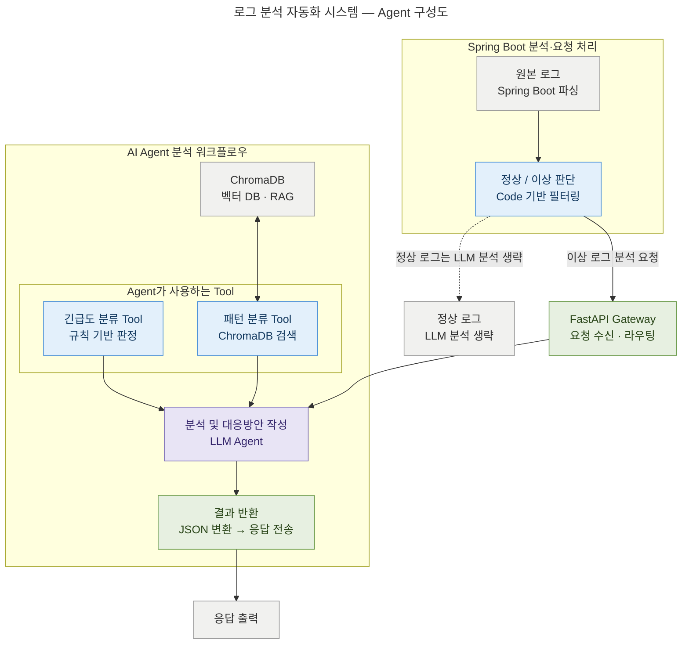

# 로그 분석 자동화 시스템 — Agent 구성도

## 범례

| 색상 | 분류 | 해당 노드 |
|------|------|-----------|
| 🟦 파랑 | Tool | 정상/이상 판단, 긴급도 분류 Tool, 패턴 분류 Tool |
| 🟪 보라 | LLM Agent | 분석 및 대응방안 작성 |
| 🟩 초록 | 게이트웨이 | FastAPI Gateway, 결과 반환 |
| ⬜ 회색 | 데이터/보조 | 원본 로그, ChromaDB, 분석 생략, 응답 출력 |

## 흐름 요약

1. **원본 로그**를 Spring Boot에서 파싱한 뒤 **정상/이상 판단**(Code 기반 필터링)을 수행합니다.
2. **정상 로그**는 LLM 분석을 생략합니다(점선 경로).
3. **이상 로그**만 FastAPI Gateway로 분석 요청을 전달합니다.
4. Gateway가 **LLM Agent**로 라우팅하고, Agent는 **긴급도 분류 Tool**과 **패턴 분류 Tool**을 사용합니다.
5. 패턴 분류 Tool은 **ChromaDB**(벡터 DB·RAG)를 검색합니다.
6. Agent가 분석·대응방안을 작성하면 **결과 반환** 단계에서 JSON으로 변환해 응답을 전송합니다.
