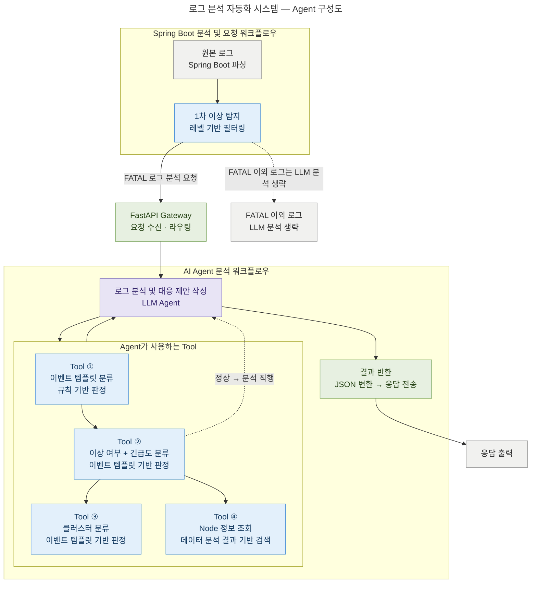

# 로그 분석 자동화 시스템 — Agent 구성도

> FastAPI 기반 · Tool + LLM Agent 파이프라인
> API 명세·설계는 [API.md](API.md), 단계별 개발 계획은 [implementation_plan.md](implementation_plan.md) 참조.

## 범례

| 색상 | 분류 | 해당 노드 |
|------|------|-----------|
| 🟦 파랑 | Tool | 1차 이상 탐지(필터링), Tool ①~④ |
| 🟪 보라 | LLM Agent | 로그 분석 및 대응 제안 작성 |
| 🟩 초록 | 게이트웨이 | FastAPI Gateway, 결과 반환 |
| ⬜ 회색 | 데이터/보조 | 원본 로그, 분석 생략, 응답 출력 |

## 흐름 요약

1. **원본 로그**를 Spring Boot에서 파싱한 뒤, **1차 이상 탐지**(레벨 기반 필터링)를 수행한다.
2. **FATAL 이외 로그**는 LLM 분석을 생략한다(점선 경로).
3. **FATAL 로그**만 FastAPI Gateway로 분석 요청을 전달한다. (정상/이상 판정은 AI 내부 **Tool ②**가 수행)
4. Gateway가 **LLM Agent**로 라우팅하고, Agent는 4개 Tool을 사용한다.
   - **① 이벤트 템플릿 분류 → ② 이상 여부 + 긴급도 분류** 순으로 수행하고, **②가 이상으로 판정하면 ③ 클러스터 분류·④ Node 정보 조회**를 이어서 수행한다.
   - **②가 정상으로 판정하면 ③④를 건너뛰고 바로 LLM 분석으로 직행**한다(점선 경로 — 정상 사유만 작성).
   - 모든 Tool은 ChromaDB 대신 **내부 정의 문서를 직접 참조**한다.
5. Agent가 분석·대응 방안을 작성하면 **결과 반환** 단계에서 JSON으로 변환해 응답을 전송한다.
