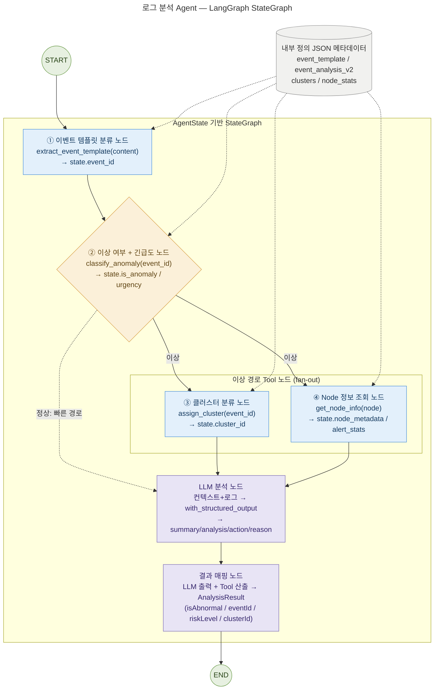

# 4단계 LangGraph 노드 구성도

> 상세 구현 목록: [step4_agent.md](step4_agent.md)
> `StateGraph` 노드와 엣지를 시각화한 다이어그램.
> **②(이상 여부 + 긴급도)에서 조건부 분기** — 정상이면 ③④를 건너뛰고 곧장 LLM으로, 이상이면 ③④로 fan-out 후 LLM에 합류한다.
> **ChromaDB 미사용** — 모든 Tool은 내부 정의 JSON 메타데이터를 직접 참조한다.

## 범례

| 색상 | 분류 | 해당 노드 |
|------|------|-----------|
| 🟦 파랑 | Tool 노드 | ① 이벤트 템플릿 분류, ③ 클러스터 분류, ④ Node 정보 조회 |
| 🟨 노랑 | 분기 노드 | ② 이상 여부 + 긴급도 분류 (`add_conditional_edges` 기준) |
| 🟪 보라 | LLM/처리 노드 | LLM 분석, 결과 매핑 |
| 🟩 초록 | 진입/종료 | START, END |
| ⬜ 회색 | 내부 메타데이터 | event_template / event_analysis_v2 / clusters / node_stats (JSON) |

## 엣지 정의

| From | To | 의미 |
|------|-----|------|
| `START` | ① 이벤트 템플릿 분류 | 진입 — 선행 노드 |
| ① 이벤트 템플릿 분류 | ② 이상 여부 + 긴급도 | `event_id` 확보 후 판정 |
| ② 이상 여부 + 긴급도 | **LLM 분석** (정상) | 조건부 분기 — `is_anomaly=False` 빠른 경로 |
| ② 이상 여부 + 긴급도 | ③ 클러스터 / ④ Node 정보 (이상) | 조건부 분기 — `is_anomaly=True` fan-out |
| ③ 클러스터 / ④ Node 정보 | LLM 분석 | 이상 경로 fan-in — 두 노드 완료 후 합류 |
| LLM 분석 | 결과 매핑 | 구조화 출력을 `AnalysisResult`로 변환 |
| 결과 매핑 | `END` | 분석 종료, 응답 반환 |

## 흐름 요약

1. `START`에서 **① 이벤트 템플릿 분류 노드**로 진입해 `event_id`를 산출한다(선행).
2. **② 이상 여부 + 긴급도 노드**가 `event_id`로 정상/이상과 `urgency`를 판정하고, `is_anomaly` 기준으로 **조건부 분기**한다.
3. **정상**이면 ③④를 건너뛰고 곧장 **LLM 분석 노드**로 가서 간결한 정상 사유만 작성한다(빠른 경로).
4. **이상**이면 **③ 클러스터 분류**와 **④ Node 정보 조회** 노드로 fan-out하여 `cluster_id`와 노드 컨텍스트를 보강한 뒤, 두 노드가 끝나면 **LLM 분석 노드**로 합류(fan-in)해 이상 근거·대응 방안을 작성한다.
5. **결과 매핑 노드**가 LLM 구조화 출력과 Tool 산출을 `AnalysisResult`(`isAbnormal`/`eventId`/`riskLevel`/`clusterId`/`analyzedAt`)로 변환한 뒤 `END`로 종료한다.

> 모든 Tool 노드는 ChromaDB 대신 **내부 정의 JSON 메타데이터**(`app/agents/tools/metadata/`)를 참조한다(점선). 상세 산출·규칙은 [step3_tools.md](step3_tools.md) 참조.
